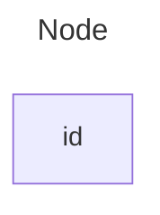
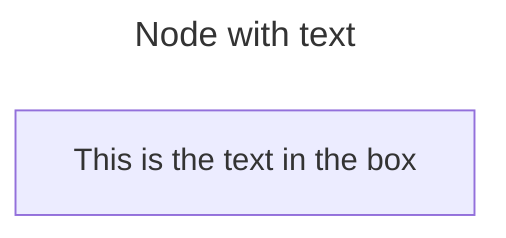
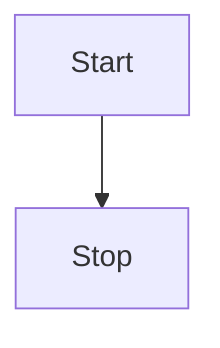
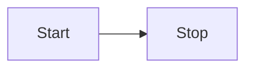
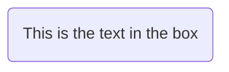
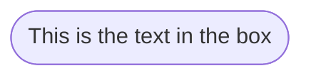
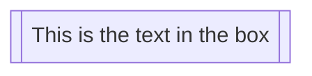
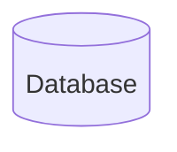
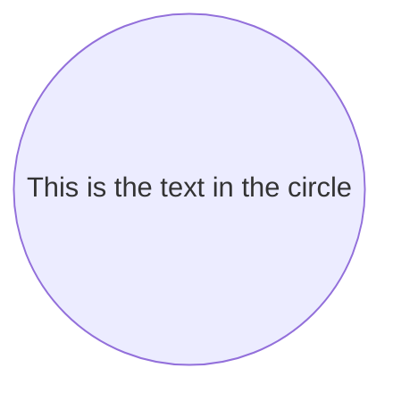
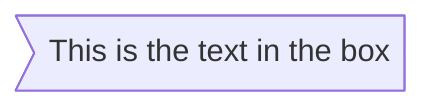

# Flowcharts - Basic Syntax

All Flowcharts are composed of **nodes**, the geometric shapes and **edges**, the arrows or lines. The mermaid code defines the way that these **nodes** and **edges** are made and interact.

It can also accommodate different arrow types, multi directional arrows, and linking to and from subgraphs.

> **Important note**: Do not type the word "end" as a Flowchart node. Capitalize all or any one the letters to keep the flowchart from breaking, i.e, "End" or "END". Or you can apply this [workaround](https://github.com/mermaid-js/mermaid/issues/1444#issuecomment-639528897).

### A node (default)




> **Note**
> The id is what is displayed in the box.

### A node with text

It is also possible to set text in the box that differs from the id. If this is done several times, it is the last text
found for the node that will be used. Also if you define edges for the node later on, you can omit text definitions. The
one previously defined will be used when rendering the box.




## Graph

This statement declares the direction of the Flowchart.

This declares the flowchart is oriented from top to bottom (`TD` or `TB`).




This declares the flowchart is oriented from left to right (`LR`).




## Flowchart Orientation

Possible FlowChart orientations are:

- TB - top to bottom
- TD - top-down/ same as top to bottom
- BT - bottom to top
- RL - right to left
- LR - left to right

## Node shapes

### A node with round edges




### A stadium-shaped node




### A node in a subroutine shape




### A node in a cylindrical shape




### A node in the form of a circle




### A node in an asymmetric shape




Currently only the shape above is possible and not its mirror. _This might change with future releases._

### A node (rhombus)

```mermaid-example
flowchart LR
    id1{This is the text in the box}
```

```mermaid
flowchart LR
    id1{This is the text in the box}
```

### A hexagon node

```mermaid-example
flowchart LR
    id1{{This is the text in the box}}
```

```mermaid
flowchart LR
    id1{{This is the text in the box}}
```

### Parallelogram

```mermaid-example
flowchart TD
    id1[/This is the text in the box/]
```

```mermaid
flowchart TD
    id1[/This is the text in the box/]
```

### Parallelogram alt

```mermaid-example
flowchart TD
    id1[\This is the text in the box\]
```

```mermaid
flowchart TD
    id1[\This is the text in the box\]
```

### Trapezoid

```mermaid-example
flowchart TD
    A[/Christmas\]
```

```mermaid
flowchart TD
    A[/Christmas\]
```

### Trapezoid alt

```mermaid-example
flowchart TD
    B[\Go shopping/]
```

```mermaid
flowchart TD
    B[\Go shopping/]
```

### Double circle

```mermaid-example
flowchart TD
    id1(((This is the text in the circle)))
```

```mermaid
flowchart TD
    id1(((This is the text in the circle)))
```

## Links between nodes

Nodes can be connected with links/edges. It is possible to have different types of links or attach a text string to a link.

### A link with arrow head

```mermaid-example
flowchart LR
    A-->B
```

```mermaid
flowchart LR
    A-->B
```

### An open link

```mermaid-example
flowchart LR
    A --- B
```

```mermaid
flowchart LR
    A --- B
```

### Text on links

```mermaid-example
flowchart LR
    A-- This is the text! ---B
```

```mermaid
flowchart LR
    A-- This is the text! ---B
```

or

```mermaid-example
flowchart LR
    A---|This is the text|B
```

```mermaid
flowchart LR
    A---|This is the text|B
```

### A link with arrow head and text

```mermaid-example
flowchart LR
    A-->|text|B
```

```mermaid
flowchart LR
    A-->|text|B
```

or

```mermaid-example
flowchart LR
    A-- text -->B
```

```mermaid
flowchart LR
    A-- text -->B
```

### Dotted link

```mermaid-example
flowchart LR
   A-.->B;
```

```mermaid
flowchart LR
   A-.->B;
```

### Dotted link with text

```mermaid-example
flowchart LR
   A-. text .-> B
```

```mermaid
flowchart LR
   A-. text .-> B
```

### Thick link

```mermaid-example
flowchart LR
   A ==> B
```

```mermaid
flowchart LR
   A ==> B
```

### Thick link with text

```mermaid-example
flowchart LR
   A == text ==> B
```

```mermaid
flowchart LR
   A == text ==> B
```

### An invisible link

This can be a useful tool in some instances where you want to alter the default positioning of a node.

```mermaid-example
flowchart LR
    A ~~~ B
```

```mermaid
flowchart LR
    A ~~~ B
```

### Chaining of links

It is possible declare many links in the same line as per below:

```mermaid-example
flowchart LR
   A -- text --> B -- text2 --> C
```

```mermaid
flowchart LR
   A -- text --> B -- text2 --> C
```

It is also possible to declare multiple nodes links in the same line as per below:

```mermaid-example
flowchart LR
   a --> b & c--> d
```

```mermaid
flowchart LR
   a --> b & c--> d
```
