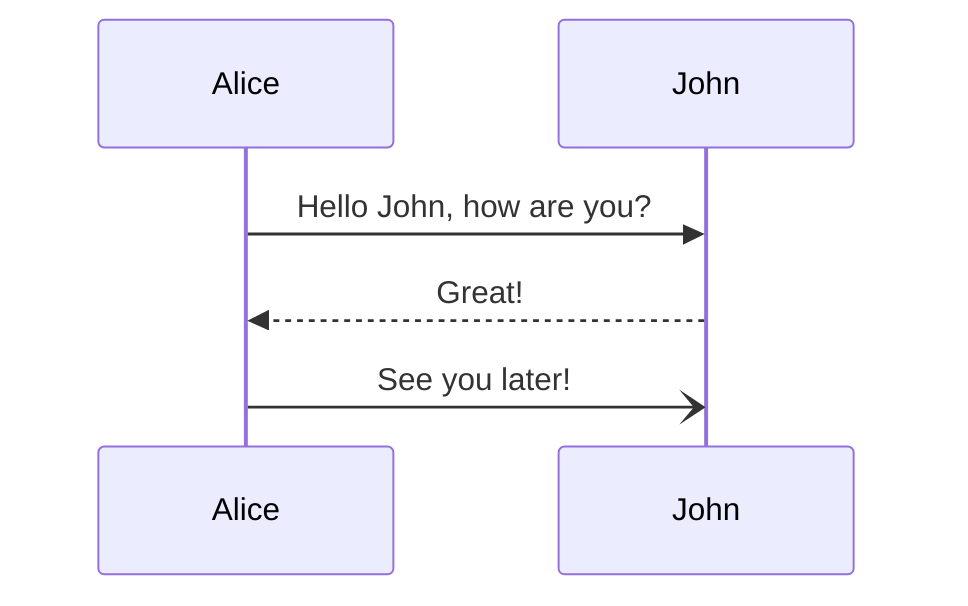
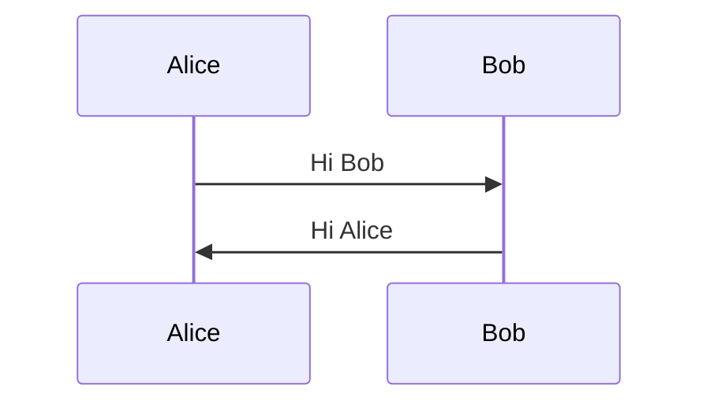
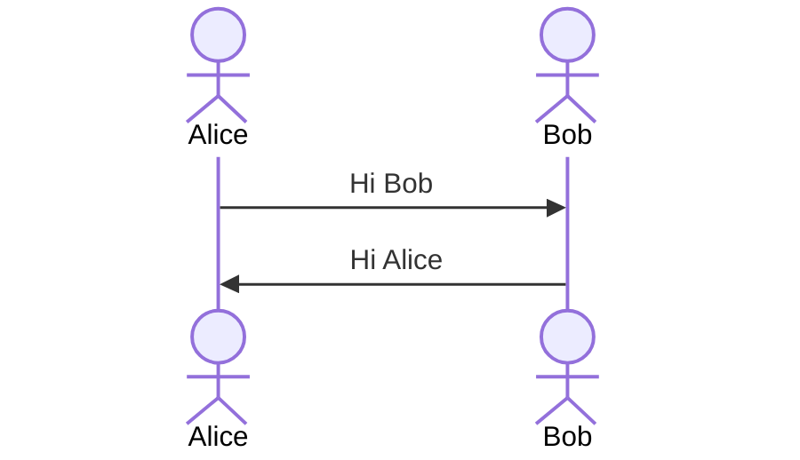
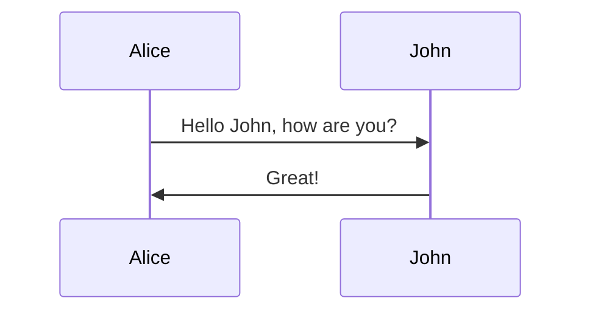
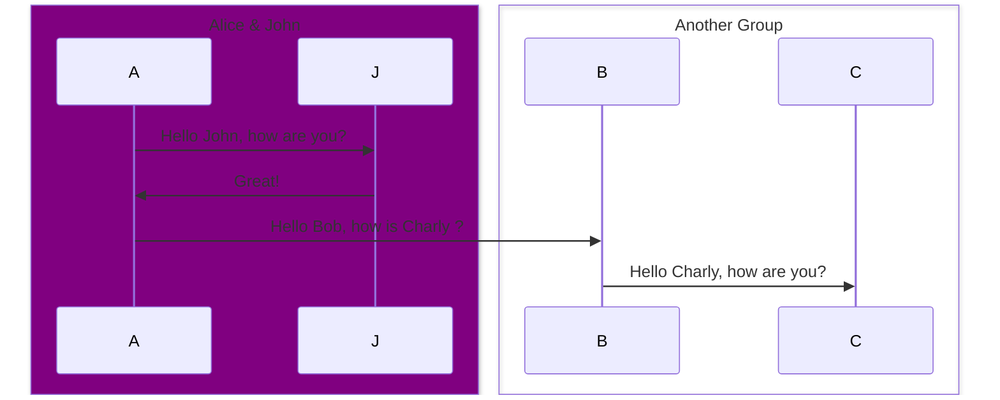
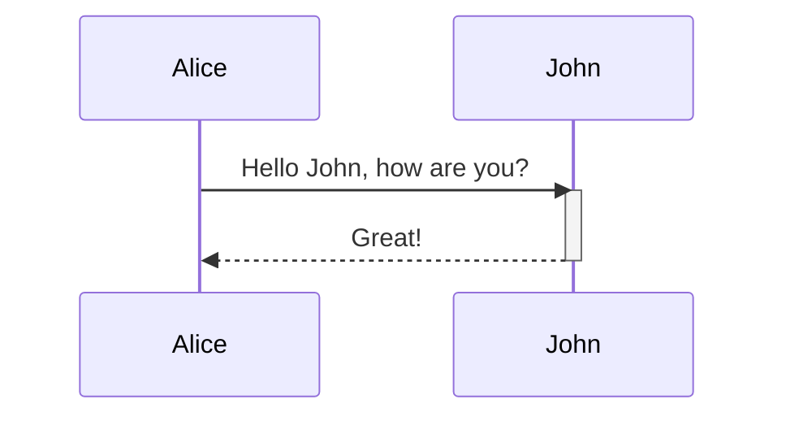
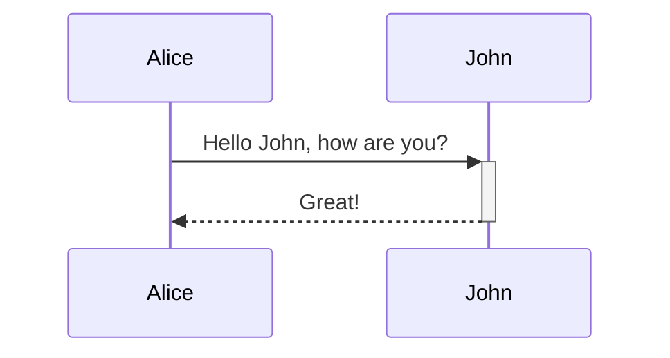
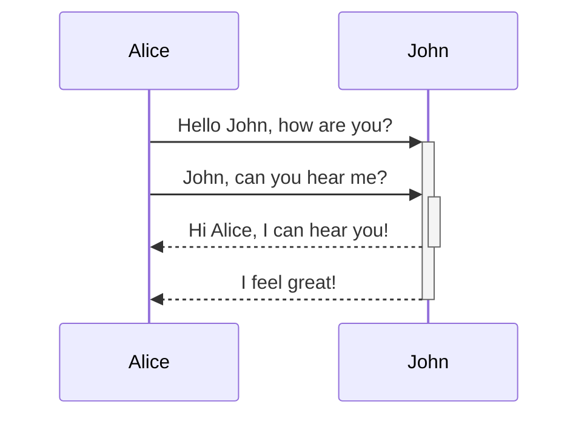
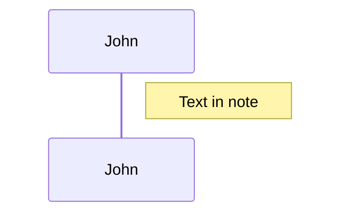
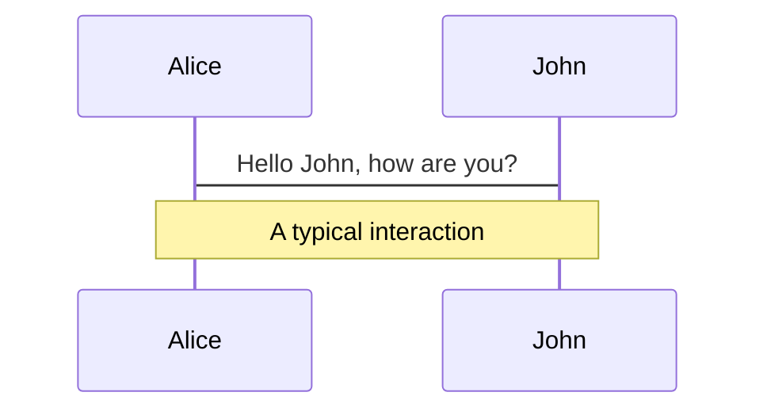

# Sequence diagrams

> A Sequence diagram is an interaction diagram that shows how processes operate with one another and in what order.

Mermaid can render sequence diagrams.




> **Note**
> A note on nodes, the word "end" could potentially break the diagram, due to the way that the mermaid language is scripted.
>
> If unavoidable, one must use parentheses(), quotation marks "", or brackets {},\[], to enclose the word "end". i.e : (end), \[end], {end}.

## Syntax

### Participants

The participants can be defined implicitly as in the first example on this page. The participants or actors are
rendered in order of appearance in the diagram source text. Sometimes you might want to show the participants in a
different order than how they appear in the first message. It is possible to specify the actor's order of
appearance by doing the following:




### Actors

If you specifically want to use the actor symbol instead of a rectangle with text you can do so by using actor statements as per below.




### Aliases

The actor can have a convenient identifier and a descriptive label.




### Grouping / Box

The actor(s) can be grouped in vertical boxes. You can define a color (if not, it will be transparent) and/or a descriptive label using the following notation:

    box Aqua Group Description
    ... actors ...
    end
    box Group without description
    ... actors ...
    end
    box rgb(33,66,99)
    ... actors ...
    end

> **Note**
> If your group name is a color you can force the color to be transparent:

    box transparent Aqua
    ... actors ...
    end




## Messages

Messages can be of two displayed either solid or with a dotted line.

    [Actor][Arrow][Actor]:Message text

There are six types of arrows currently supported:

| Type   | Description                                      |
| ------ | ------------------------------------------------ |
| `->`   | Solid line without arrow                         |
| `-->`  | Dotted line without arrow                        |
| `->>`  | Solid line with arrowhead                        |
| `-->>` | Dotted line with arrowhead                       |
| `-x`   | Solid line with a cross at the end               |
| `--x`  | Dotted line with a cross at the end.             |
| `-)`   | Solid line with an open arrow at the end (async) |
| `--)`  | Dotted line with a open arrow at the end (async) |

## Activations

It is possible to activate and deactivate an actor. (de)activation can be dedicated declarations:




There is also a shortcut notation by appending `+`/`-` suffix to the message arrow:




Activations can be stacked for same actor:




## Notes

It is possible to add notes to a sequence diagram. This is done by the notation
Note \[ right of | left of | over ] \[Actor]: Text in note content

See the example below:




It is also possible to create notes spanning two participants:




It is also possible to add a line break (applies to text input in general):

```mermaid-example
sequenceDiagram
    Alice->John: Hello John, how are you?
    Note over Alice,John: A typical interaction<br/>But now in two lines
```

```mermaid
sequenceDiagram
    Alice->John: Hello John, how are you?
    Note over Alice,John: A typical interaction<br/>But now in two lines
```

## Loops

It is possible to express loops in a sequence diagram. This is done by the notation

    loop Loop text
    ... statements ...
    end

See the example below:

```mermaid-example
sequenceDiagram
    Alice->John: Hello John, how are you?
    loop Every minute
        John-->Alice: Great!
    end
```

```mermaid
sequenceDiagram
    Alice->John: Hello John, how are you?
    loop Every minute
        John-->Alice: Great!
    end
```

## Alt

It is possible to express alternative paths in a sequence diagram. This is done by the notation

    alt Describing text
    ... statements ...
    else
    ... statements ...
    end

or if there is sequence that is optional (if without else).

    opt Describing text
    ... statements ...
    end

See the example below:

```mermaid-example
sequenceDiagram
    Alice->>Bob: Hello Bob, how are you?
    alt is sick
        Bob->>Alice: Not so good :(
    else is well
        Bob->>Alice: Feeling fresh like a daisy
    end
    opt Extra response
        Bob->>Alice: Thanks for asking
    end
```

```mermaid
sequenceDiagram
    Alice->>Bob: Hello Bob, how are you?
    alt is sick
        Bob->>Alice: Not so good :(
    else is well
        Bob->>Alice: Feeling fresh like a daisy
    end
    opt Extra response
        Bob->>Alice: Thanks for asking
    end
```

## Parallel

It is possible to show actions that are happening in parallel.

This is done by the notation

    par [Action 1]
    ... statements ...
    and [Action 2]
    ... statements ...
    and [Action N]
    ... statements ...
    end

See the example below:

```mermaid-example
sequenceDiagram
    par Alice to Bob
        Alice->>Bob: Hello guys!
    and Alice to John
        Alice->>John: Hello guys!
    end
    Bob-->>Alice: Hi Alice!
    John-->>Alice: Hi Alice!
```

```mermaid
sequenceDiagram
    par Alice to Bob
        Alice->>Bob: Hello guys!
    and Alice to John
        Alice->>John: Hello guys!
    end
    Bob-->>Alice: Hi Alice!
    John-->>Alice: Hi Alice!
```

It is also possible to nest parallel blocks.

```mermaid-example
sequenceDiagram
    par Alice to Bob
        Alice->>Bob: Go help John
    and Alice to John
        Alice->>John: I want this done today
        par John to Charlie
            John->>Charlie: Can we do this today?
        and John to Diana
            John->>Diana: Can you help us today?
        end
    end
```

```mermaid
sequenceDiagram
    par Alice to Bob
        Alice->>Bob: Go help John
    and Alice to John
        Alice->>John: I want this done today
        par John to Charlie
            John->>Charlie: Can we do this today?
        and John to Diana
            John->>Diana: Can you help us today?
        end
    end
```

## Critical Region

It is possible to show actions that must happen automatically with conditional handling of circumstances.

This is done by the notation

    critical [Action that must be performed]
    ... statements ...
    option [Circumstance A]
    ... statements ...
    option [Circumstance B]
    ... statements ...
    end

See the example below:

```mermaid-example
sequenceDiagram
    critical Establish a connection to the DB
        Service-->DB: connect
    option Network timeout
        Service-->Service: Log error
    option Credentials rejected
        Service-->Service: Log different error
    end
```