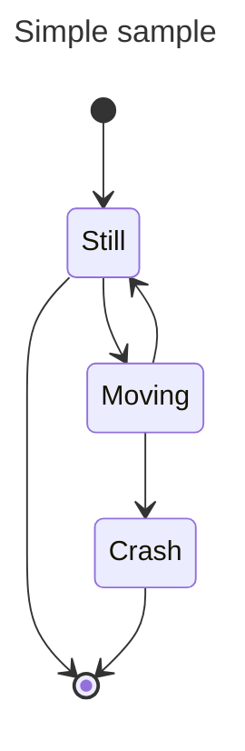
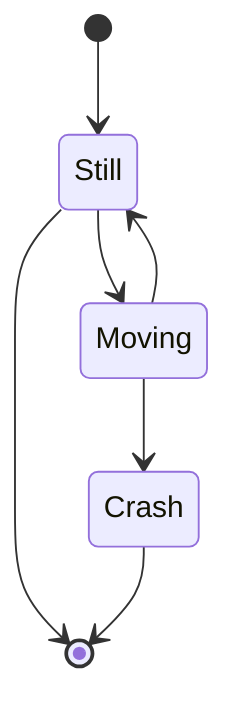
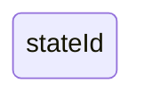
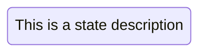
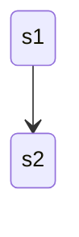
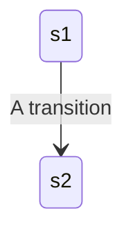
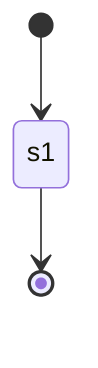
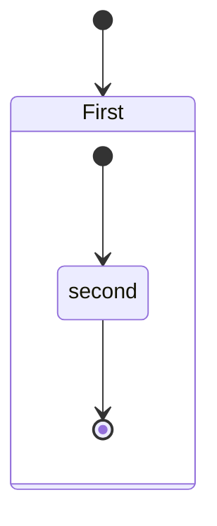
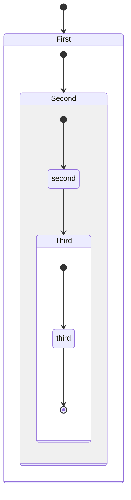

# State diagrams

> "A state diagram is a type of diagram used in computer science and related fields to describe the behavior of systems.
> State diagrams require that the system described is composed of a finite number of states; sometimes, this is indeed the
> case, while at other times this is a reasonable abstraction." Wikipedia

Mermaid can render state diagrams. The syntax tries to be compliant with the syntax used in plantUml as this will make
it easier for users to share diagrams between mermaid and plantUml.

Older renderer:

In state diagrams systems are described in terms of _states_ and how one _state_ can change to another _state_ via
a _transition._ The example diagram above shows three states: **Still**, **Moving** and **Crash**. You start in the
**Still** state. From **Still** you can change to the **Moving** state. From **Moving** you can change either back to the **Still** state or to
the **Crash** state. There is no transition from **Still** to **Crash**. (You can't crash if you're still.)

## States

A state can be declared in multiple ways. The simplest way is to define a state with just an id:

Another way is by using the state keyword with a description as per below:

Another way to define a state with a description is to define the state id followed by a colon and the description:

## Transitions

Transitions are path/edges when one state passes into another. This is represented using text arrow, "-->".

When you define a transition between two states and the states are not already defined, the undefined states are defined
with the id from the transition. You can later add descriptions to states defined this way.

It is possible to add text to a transition to describe what it represents:

## Start and End

There are two special states indicating the start and stop of the diagram. These are written with the \[\*] syntax and
the direction of the transition to it defines it either as a start or a stop state.

## Composite states

In a real world use of state diagrams you often end up with diagrams that are multidimensional as one state can
have several internal states. These are called composite states in this terminology.

In order to define a composite state you need to use the state keyword followed by an id and the body of the composite
state between {}. See the example below:

You can do this in several layers:

