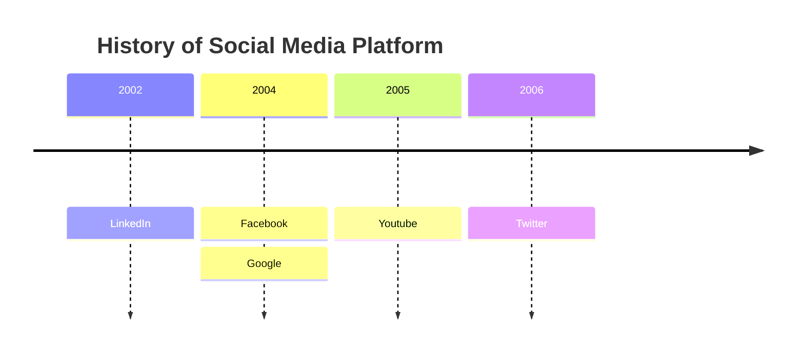
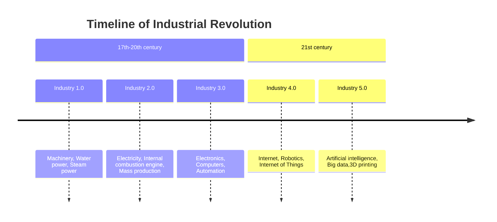
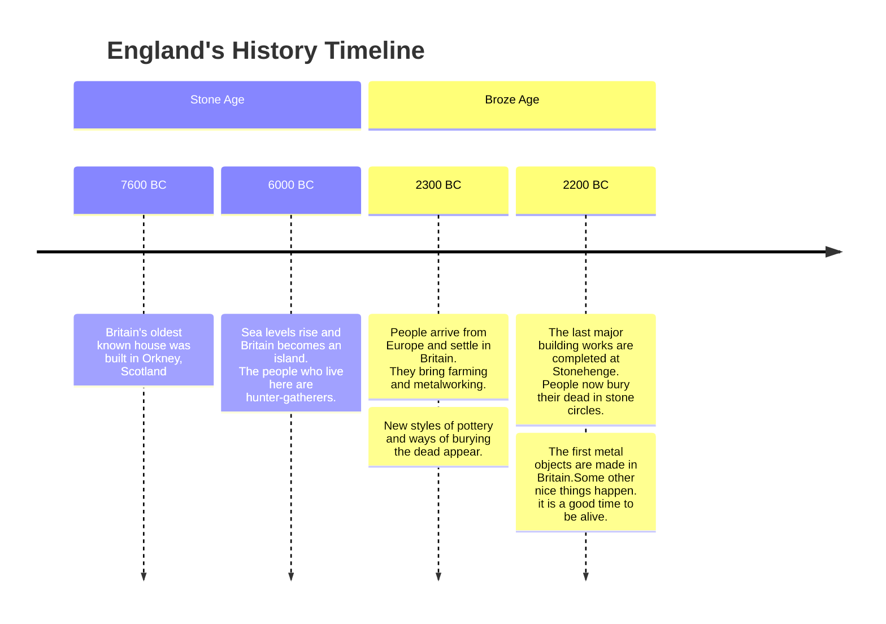
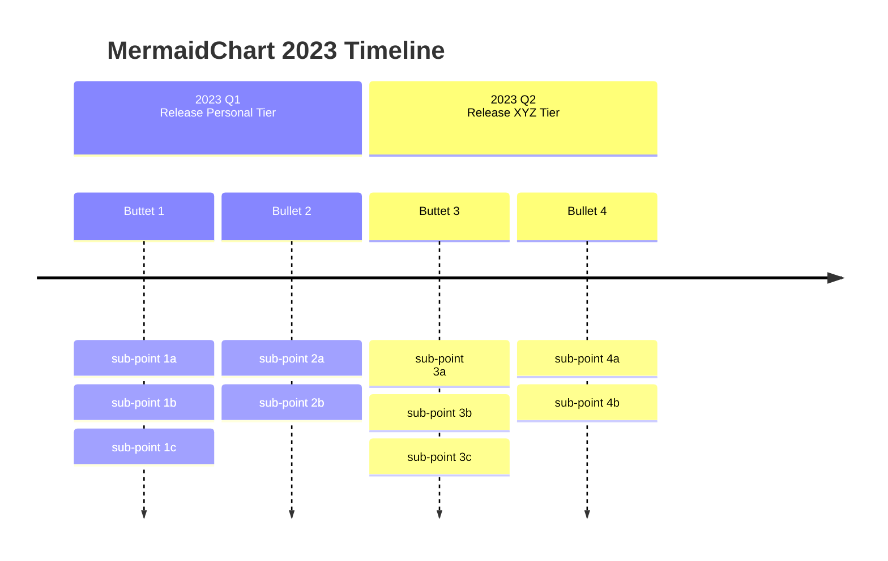

# Timeline Diagram

"A timeline is a type of diagram used to illustrate a chronology of events, dates, or periods of time. It is usually presented graphically to indicate the passing of time, and it is usually organized chronologically. A basic timeline presents a list of events in chronological order, usually using dates as markers. A timeline can also be used to show the relationship between events, such as the relationship between the events of a person's life." Wikipedia

### An example of a timeline.




## Syntax

The syntax for creating Timeline diagram is simple. You always start with the `timeline` keyword to let mermaid know that you want to create a timeline diagram.

After that there is a possibility to add a title to the timeline. This is done by adding a line with the keyword `title` followed by the title text.

Then you add the timeline data, where you always start with a time period, followed by a colon and then the text for the event. Optionally you can add a second colon and then the text for the event. So, you can have one or more events per time period.

```
{time period} : {event}
```

or

```
{time period} : {event} : {event}
```

or

```
{time period} : {event}
              : {event}
              : {event}
```

NOTE: Both time period and event are simple text, and not limited to numbers.

Let us look at the syntax for the example above.


In this way we can use a text outline to generate a timeline diagram.

## Grouping of time periods in sections/ages




## Wrapping of text for long time-periods or events






